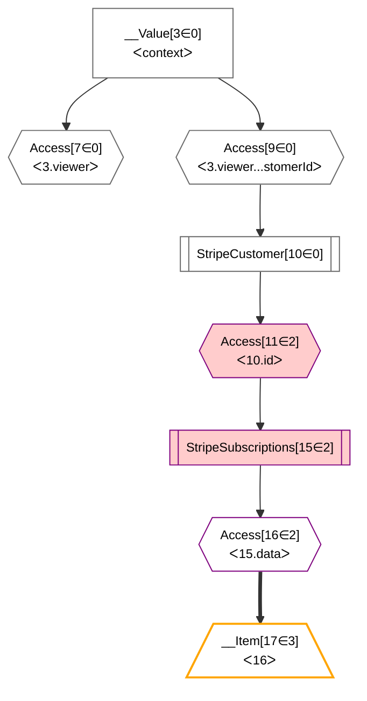
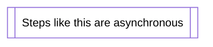
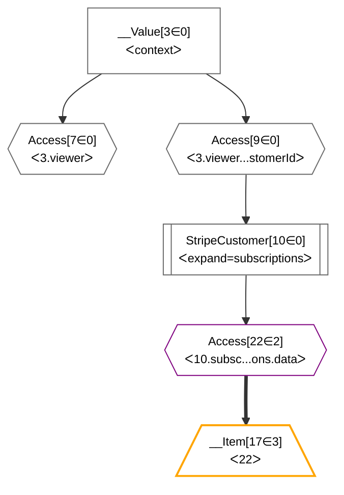

# Grafast Stripe Example

Gra*fast* is a cutting-edge planning and execution engine for GraphQL; it
replaces the concept of "resolvers" in a GraphQL schema with "plan resolvers".
These plan resolvers outline the steps that need to be taken, but don't
actually execute them. Gra*fast* builds up a "plan" by calling
the plan resolvers for each field in the incoming request, and then it gives
each step in the plan a chance to optimize or replace itself. This can
lead to significantly more efficient GraphQL execution.

For more information on Gra*fast*, see https://grafast.org

This repository contains a working example showing how a `StripeSubscriptions`
step can "optimize" itself to be inlined into a `StripeCustomer` step if the
circumstances are right.

In `index.ts` we issue a query to the server:

```graphql
{
  viewer {
    id
    stripeCustomer {
      id
      currency
      invoicePrefix
      subscriptions {
        id
        status
        description
      }
    }
  }
}
```

In GraphQL this would have either required the stripe customer to always
include subscriptions (even when they were not requested), or to have to follow
up and fetch the subscriptions in a second request.

However, by using Gra*fast*, we can optimize the plan.

Initially our plan diagram will look like this (highlighting added):



Note that the steps with two bars on each side are "asynchronous" steps, steps
that do work (in this case, making requests to Slack):



Fortunately, the [`optimize` method on
`StripeSubscriptionsStep`](https://github.com/benjie/grafast-stripe-example/blob/e670921885c03e5d7d8ce8afa24abf146f2d5c53/src/steps/stripeSubscriptions.ts#L42-L59)
can determine that the dependency of `StripeSubscriptions[15]` is an `access`
step of the `"id"` property of a `StripeCustomerStep` (`StripeCustomer[10]`),
and thus can ask that `StripeCustomer` to
["expand"](https://stripe.com/docs/expand?locale=en-GB) the `subscriptions`
field instead (replacing itself).

This results in this plan diagram; note we now only have one asynchronous step,
we don't need two round-trips to Stripe any more:



If we were to just request the customer, without their subscriptions, then
we will not ask for subscription data from Stripe.
